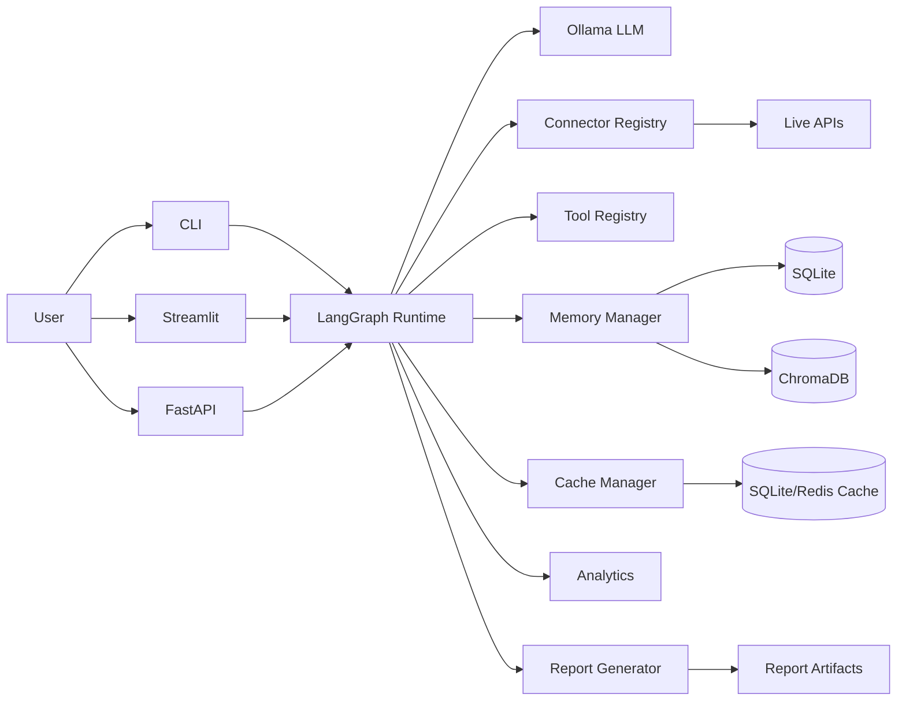
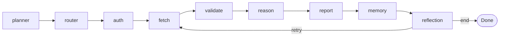

# Architecture

## System Overview

## LangGraph Node Flow

## Data Contracts

- `AnalyzeRequest`: user query, model selection, APIs, cache/memory flags.
- `ConnectorResult`: normalized provider result with latency and errors.
- `AnalyzeResponse`: summary, insights, recommendations, sources, charts, artifacts.

## Reliability Controls

- Async HTTP with retry + exponential backoff.
- Provider-level graceful degradation on missing credentials.
- Cache-first for repeat calls.
- Reflection retry loop for retryable errors.
- Structured logs + runtime metrics + persistent history.
