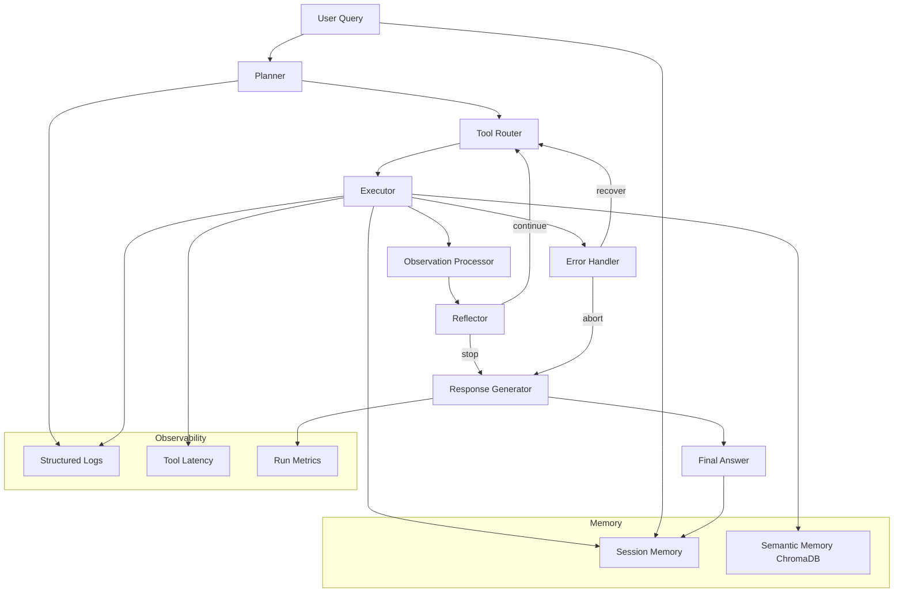

# Architecture

## System Graph

## Package Layout

- `src/reasoning_agent/agent`: planner, router, executor, reflection, graph, runner
- `src/reasoning_agent/tools`: dynamic tool contracts, registry, required + optional tools
- `src/reasoning_agent/memory`: session and Chroma semantic memory
- `src/reasoning_agent/llm`: Ollama provider and model management
- `src/reasoning_agent/evals`: benchmark dataset, runner, judge, reports
- `src/reasoning_agent/observability`: event schema, tracer, metrics, visualizations
- `streamlit_app/`: professional multi-page UI

## Runtime Modes

- `graph`: explicit LangGraph execution path.
- `fallback`: deterministic planner→router→executor loop (default in `configs/settings.yaml`).
- `auto`: graph first, then fallback on timeout/failure.
- `Offline mode`: set `AGENT_OFFLINE_MODE=1` to short-circuit network tools with structured fallback outputs.
