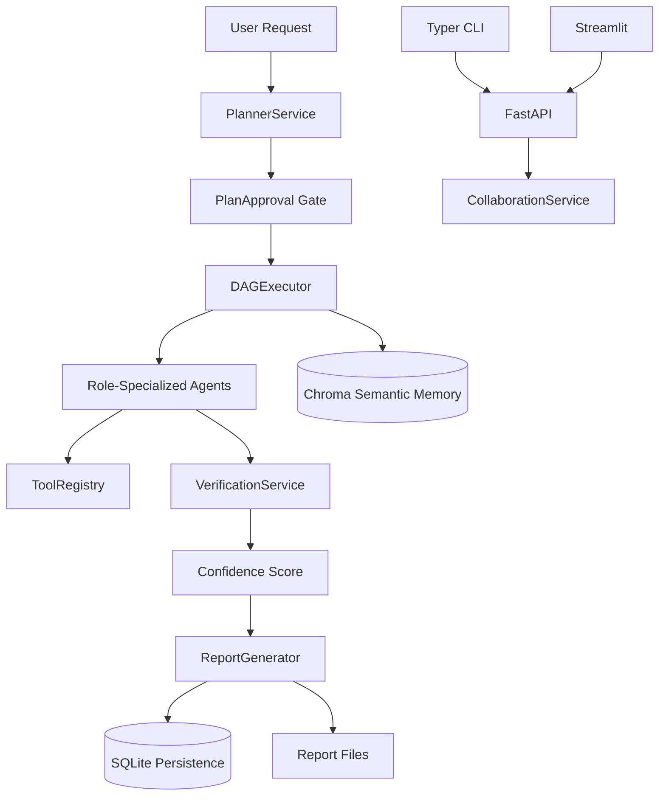

# Project #29 - Production-Grade Multi-Agent AI Collaboration Platform (CrewAI + LangGraph + Ollama)

This repository contains a production-oriented multi-agent collaboration platform with:

- Planner-driven task DAG decomposition
- Human approval gate before execution
- Multi-agent execution with role-specialized outputs
- Verification + reflection + confidence scoring
- Persistent memory (SQLite) + semantic memory (Chroma)
- RAG ingestion/retrieval
- FastAPI backend, Typer CLI, Streamlit dashboard
- MCP-compatible internal tool surface + external MCP adapters

This README is based on **real execution performed on June 30, 2026** in this repository.

## 1) What Was Actually Verified (Real Run Summary)

### Build and dependency verification (real)
- `UV_CACHE_DIR=/tmp/uv-cache uv sync --all-groups --python 3.12` -> success
- `UV_CACHE_DIR=/tmp/uv-cache uv run python -m compileall src tests scripts streamlit_app` -> success
- `UV_CACHE_DIR=/tmp/uv-cache uv build` -> success
- Built artifacts:
  - `dist/production_crewai_multi_agent_platform-0.1.0-py3-none-any.whl`
  - `dist/production_crewai_multi_agent_platform-0.1.0.tar.gz`

### Test suite (real)
- `UV_CACHE_DIR=/tmp/uv-cache uv run pytest -q` -> **8 passed**

### End-to-end pipeline (real)
- `UV_CACHE_DIR=/tmp/uv-cache uv run python scripts/run_demo.py` -> success
- Real model inference executed through Ollama via internal LLM layer.
- Verified produced final run metrics with no runtime exception.

### Live API execution (real)
A full API flow was executed:
1. `POST /crew` (plan)
2. `POST /crew/{run_id}/approve`
3. `POST /crew/{run_id}/execute`
4. `GET /tasks`, `GET /reports`, `GET /analytics`

Real run ID used during verification:
- `run-2d13d833f7`

Observed results:
- `status=completed`
- `completed_tasks=7/7`
- `confidence=0.762`
- `error=null`

### CLI execution (real)
Validated these commands:
- `crew-platform agents`
- `crew-platform task <run_id> --api-url http://127.0.0.1:8000`
- `crew-platform report <run_id> --format html --api-url http://127.0.0.1:8000`
- `crew-platform memory --limit 10 --api-url http://127.0.0.1:8000`

### Streamlit execution (real)
- `uv run python app.py` started Streamlit successfully
- HTTP check against local Streamlit endpoint returned `200`

## 2) Architecture (Code-Level)



Core modules:
- `src/crew_platform/orchestration/`
  - `planner.py` (dynamic task planning)
  - `executor.py` (dependency-aware parallel execution)
  - `verification.py` (fact/QA/reflection confidence scoring)
  - `service.py` (top-level orchestration lifecycle)
- `src/crew_platform/tools/` (pluggable tool system)
- `src/crew_platform/memory/`
  - `persistence.py` (SQLite repositories)
  - `runtime.py` (session + semantic memory manager)
- `src/crew_platform/rag/` (ingestion + retrieval)
- `src/crew_platform/api/main.py` (FastAPI endpoints)
- `src/crew_platform/cli/main.py` (Typer commands)
- `streamlit_app/` (dashboard pages)

## 3) Enterprise Agent Team

Configured in `configs/agents.yaml`:
- Executive Planner
- Market Research Analyst
- Business Analyst
- Data Analyst
- Competitive Intelligence Agent
- Financial Analyst
- SEO Expert
- Technical Research Agent
- Content Strategist
- Technical Writer
- Fact Checker
- Reflection Agent
- QA Agent
- Memory Manager
- Report Generator

Each agent includes role, goal, backstory, constraints, tool list, and output schema.

## 4) Configuration

Primary settings file: `configs/settings.yaml`

Key settings verified:
- Ollama base URL and model list
- parallelism (`max_parallel_tasks: 2`)
- retries and backoff
- mandatory plan approval
- confidence threshold for consensus
- SQLite + Chroma paths
- report formats

### CrewAI execution mode
- `orchestration.use_crewai_execution` is currently set to `false` by default for stable runtime.
- CrewAI integration remains implemented and can be enabled by setting it to `true`.

## 5) API Endpoints

Implemented endpoints:
- `/chat`
- `/crew`
- `/agents`
- `/tasks`
- `/memory`
- `/reports`
- `/search`
- `/knowledge`
- `/analytics`
- `/health`
- `/metrics`

Plus workflow controls:
- `/crew/{run_id}/approve`
- `/crew/{run_id}/execute`
- `/crew/{run_id}/pause`
- `/crew/{run_id}/resume`
- `/tasks/{run_id}/rerun`

MCP endpoints:
- `GET /mcp/tools`
- `POST /mcp/call`
- `GET /mcp/external/tools`
- `POST /mcp/external/call`

## 6) Zero-to-Hero Runbook

## Step 0 - Prerequisites
- Linux (validated on Ubuntu)
- Python 3.12
- `uv`
- Ollama running locally (`http://127.0.0.1:11434`)

## Step 1 - Install dependencies
```bash
uv venv .venv
source .venv/bin/activate
UV_CACHE_DIR=/tmp/uv-cache uv sync --all-groups --python 3.12
```

## Step 2 - Compile and build
```bash
UV_CACHE_DIR=/tmp/uv-cache uv run python -m compileall src tests scripts streamlit_app
UV_CACHE_DIR=/tmp/uv-cache uv build
```

## Step 3 - Run tests
```bash
UV_CACHE_DIR=/tmp/uv-cache uv run pytest -q
```
Expected: all tests pass.

## Step 4 - Run full demo pipeline
```bash
UV_CACHE_DIR=/tmp/uv-cache uv run python scripts/run_demo.py
```
Expected:
- plan created
- 7 tasks executed
- final report generated
- no unhandled exception

## Step 5 - Start API service
```bash
UV_CACHE_DIR=/tmp/uv-cache uv run crew-platform-api
```
Then open docs:
- `http://127.0.0.1:8000/docs`

## Step 6 - Execute real API flow
```bash
curl -X POST http://127.0.0.1:8000/crew \
  -H 'content-type: application/json' \
  -d '{"query":"Produce enterprise AI collaboration launch recommendations with risks and KPIs","auto_execute":false}'

curl -X POST http://127.0.0.1:8000/crew/<run_id>/approve \
  -H 'content-type: application/json' \
  -d '{"approved":true,"reviewer":"e2e"}'

curl -X POST http://127.0.0.1:8000/crew/<run_id>/execute
curl "http://127.0.0.1:8000/reports?run_id=<run_id>"
```

## Step 7 - Run CLI commands
```bash
UV_CACHE_DIR=/tmp/uv-cache uv run crew-platform agents
UV_CACHE_DIR=/tmp/uv-cache uv run crew-platform task <run_id> --api-url http://127.0.0.1:8000
UV_CACHE_DIR=/tmp/uv-cache uv run crew-platform report <run_id> --format html --api-url http://127.0.0.1:8000
UV_CACHE_DIR=/tmp/uv-cache uv run crew-platform memory --limit 10 --api-url http://127.0.0.1:8000
```

## Step 8 - Start dashboard
```bash
UV_CACHE_DIR=/tmp/uv-cache uv run python app.py
```

## 7) Verified Output Artifacts

Generated and validated during real run:
- `dist/production_crewai_multi_agent_platform-0.1.0-py3-none-any.whl`
- `dist/production_crewai_multi_agent_platform-0.1.0.tar.gz`
- `artifacts/platform.db`
- `artifacts/mlruns/mlflow.db`
- `artifacts/workflow/run-2d13d833f7.html`
- `data/reports/run-2d13d833f7.md`
- `data/reports/run-2d13d833f7.json`
- `data/reports/run-2d13d833f7.html`

Screenshots captured in:
- `docs/screenshots/`

## 8) Troubleshooting

### Ollama not reachable
- Verify service:
  - `curl http://127.0.0.1:11434/api/tags`

### Slow or long-running model calls
- Reduce `llm.max_tokens` in `configs/settings.yaml`
- Keep `max_parallel_tasks` at 2 for stable local inference

### Chroma issues in restricted environments
- Disable semantic memory temporarily:
  - `CREW_PLATFORM_DISABLE_CHROMA=1`

## 9) Project Status

Current state after real verification:
- Build: PASS
- Tests: PASS
- Demo E2E: PASS
- API E2E: PASS
- CLI flows: PASS
- Streamlit startup: PASS
- Artifact generation: PASS
