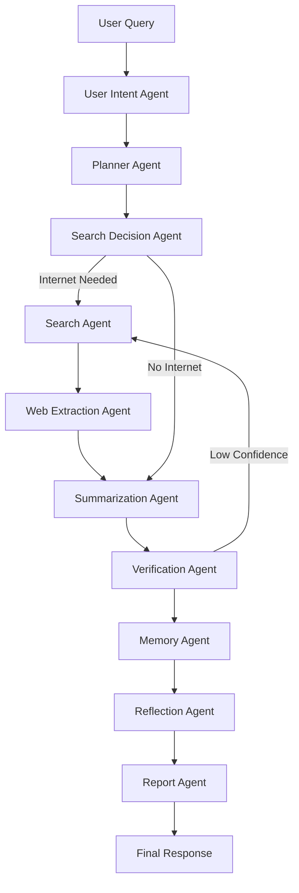

# Project #28: Production Internet AI Agent (Zero-to-Hero)

Production-grade internet-connected AI agent platform with:

- LangGraph multi-agent orchestration
- Ollama local model routing
- Hybrid retrieval (web + cache + vector memory)
- SQLite + ChromaDB persistent memory
- FastAPI + Streamlit + Typer CLI + MCP server

This README is based on a real end-to-end run executed on **June 30, 2026** in this repository.

## Verified Environment

- OS: Ubuntu (Linux)
- Python: `3.14.4` (host runtime during validation)
- `uv`: `0.11.19`
- Ollama: `0.30.11`
- GPU telemetry validated through `/monitor` endpoint

Note: Project target is Python 3.12+, but this run was verified on Python 3.14.4.

## What Was Built

- 10-agent workflow:
  - User Intent, Planner, Search Decision, Search, Web Extraction, Summarization, Verification, Memory, Reflection, Report
- Tooling:
  - DuckDuckGo, News, Wikipedia, GitHub, fetch/extract pipeline, calculator/date utilities, file readers
- Persistence:
  - SQLite (`artifacts/memory.db`) for history/cache/tool logs/reports
  - ChromaDB (`artifacts/chroma`) for semantic recall
- Interfaces:
  - FastAPI (`/chat`, `/search`, `/browse`, `/history`, `/memory`, `/report`, `/health`, `/metrics`, `/monitor`, `/analytics`, `/docs`)
  - Streamlit multipage dashboard
  - CLI (`internet-agent ...`)
  - MCP stdio server

## Architecture

### LangGraph Workflow



### Retrieval Pipeline

`query -> providers -> ranked URLs -> fetch -> clean/extract -> chunk -> embed -> Chroma -> answer context`

## Repository Structure

```text
.
├── configs/config.yaml
├── notebooks/zero_to_hero_internet_agent.ipynb
├── notebooks/zero_to_hero_internet_agent.executed.ipynb
├── src/internet_agent/
│   ├── agent/
│   ├── api/
│   ├── llm/
│   ├── mcp/
│   ├── memory/
│   ├── prompts/
│   ├── retrieval/
│   ├── services/
│   └── tools/
├── streamlit_app/
├── tests/
├── artifacts/
├── outputs/reports/
└── outputs/screenshots/
```

## Zero-to-Hero Setup

### 1) Create environment and install dependencies

```bash
uv venv .venv
source .venv/bin/activate
uv sync --all-groups
```

### 2) Configure (already included)

Primary config file:

- `configs/config.yaml`

Important model mapping used in this run:

- `planning_model`: `qwen3:8b`
- `reasoning_model`: `llama3.1:8b`
- `summarization_model`: `gemma3:4b`
- `verification_model`: `deepseek-r1:8b`
- `reflection_model`: `mistral:7b`

### 3) Pull required Ollama models

```bash
ollama pull qwen3:8b
ollama pull llama3.1:8b
ollama pull gemma3:4b
ollama pull deepseek-r1:8b
ollama pull mistral:7b
ollama pull phi4-mini:3.8b
```

Validated installed tags from live run:

- `mistral:7b`
- `deepseek-r1:8b`
- `gemma3:4b`
- `llama3.1:8b`
- `qwen3:8b`
- `phi4-mini:3.8b`

### 4) Build and test

```bash
uv build
uv run pytest
```

Live result:

- Build artifacts:
  - `dist/production_internet_ai_agent-0.1.0.tar.gz`
  - `dist/production_internet_ai_agent-0.1.0-py3-none-any.whl`
- Tests:
  - `5 passed in 7.66s`

## Run the Platform

### CLI

```bash
uv run internet-agent doctor
uv run internet-agent chat "What is the latest stable Python release as of today? Include sources."
uv run internet-agent search "today NVIDIA news"
uv run internet-agent summarize https://www.python.org/
uv run internet-agent memory --query "gradient descent" --top-k 3
uv run internet-agent report
```

Live CLI artifacts:

- `outputs/reports/step2_cli_doctor.txt`
- `outputs/reports/step2_cli_chat.txt`
- `outputs/reports/step2_cli_search.txt`
- `outputs/reports/step2_cli_summarize.txt`
- `outputs/reports/step2_cli_memory.txt`
- `outputs/reports/step2_cli_report.txt`

### FastAPI

```bash
uv run uvicorn internet_agent.api.app:app --host 127.0.0.1 --port 8000
```

Swagger:

- `http://127.0.0.1:8000/docs`

Live endpoint artifacts generated:

- `outputs/reports/step2_api_health.json`
- `outputs/reports/step2_api_metrics.json`
- `outputs/reports/step2_api_chat.json`
- `outputs/reports/step2_api_search.json`
- `outputs/reports/step2_api_browse.json`
- `outputs/reports/step2_api_history.json`
- `outputs/reports/step2_api_memory.json`
- `outputs/reports/step2_api_report.json`
- `outputs/reports/step2_api_monitor.json`
- `outputs/reports/step2_api_analytics.json`
- `outputs/reports/step2_api_docs.html`

### Streamlit

```bash
uv run streamlit run streamlit_app/Home.py --server.headless true --server.address 127.0.0.1 --server.port 8501
```

Live UI verification artifacts:

- `outputs/reports/step2_streamlit_health.txt` (`ok`)
- `outputs/reports/step2_streamlit_home.html`

Screenshots:

- `outputs/screenshots/streamlit_home.png`
- `outputs/screenshots/streamlit_chat.png`
- `outputs/screenshots/streamlit_search.png`
- `outputs/screenshots/streamlit_memory.png`
- `outputs/screenshots/streamlit_analytics.png`
- `outputs/screenshots/streamlit_monitoring.png`
- `outputs/screenshots/fastapi_docs.png`

### MCP

MCP artifacts from live execution:

- `outputs/reports/mcp_initialize.json`
- `outputs/reports/mcp_tools_list.json`
- `outputs/reports/mcp_tool_call.json`

## Verified Runtime Artifacts

- Package builds: `dist/*`
- Memory DB: `artifacts/memory.db`
- MLflow DB: `artifacts/mlruns/mlflow.db`
- Chroma store: `artifacts/chroma/`
- Reports: `outputs/reports/*`
- Verification summary: `outputs/reports/step3_result_verification.txt`

## Prompt Assets

Prompt templates used by role:

- `src/internet_agent/prompts/search_planning.md`
- `src/internet_agent/prompts/summarization.md`
- `src/internet_agent/prompts/verification.md`
- `src/internet_agent/prompts/reflection.md`
- `src/internet_agent/prompts/report_generation.md`

## Educational Notebook

- Source notebook: `notebooks/zero_to_hero_internet_agent.ipynb`
- Executed notebook: `notebooks/zero_to_hero_internet_agent.executed.ipynb`

## Production Notes

- API key guard is configurable (`configs/config.yaml -> api.require_api_key`).
- Structured logs write to `artifacts/logs/agent.jsonl`.
- MLflow is enabled and writing to SQLite tracking DB.
- Verification loop can trigger re-search when confidence is low.

## Final Status (This Run)

- Dependency sync: complete
- Model provisioning: complete
- Build: complete
- Tests: complete
- CLI live execution: complete
- FastAPI live execution: complete
- Streamlit live execution: complete
- Artifact generation: complete
