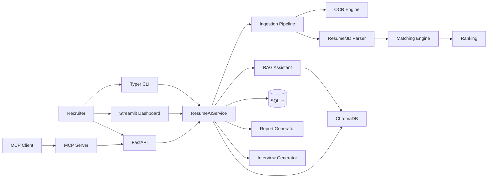

# Architecture

## System Overview

## Data Flow

1. Resume uploaded through API/UI/CLI.
2. Reader extracts text or routes to OCR.
3. Parser builds `ResumeParseResult` schema.
4. Candidate/resume persisted in SQLite.
5. Embeddings pushed into ChromaDB.
6. JD parser creates normalized requirement schema.
7. Matching engine computes weighted explainable score.
8. RAG retriever serves recruiter semantic queries.
9. Report engine exports artifacts (md/html/pdf/json).

## Storage

- SQLite tables: candidates, resumes, jobs, scores, interviews, reports, notes, processing_jobs, metrics.
- Chroma collections: resume_chunks, job_descriptions, candidate_summaries, projects, experience, interview_feedback.

## Explainability Contract

Each score output returns:

- matched skills
- missing skills
- per-component weighted scores
- evidence snippets
- confidence value
