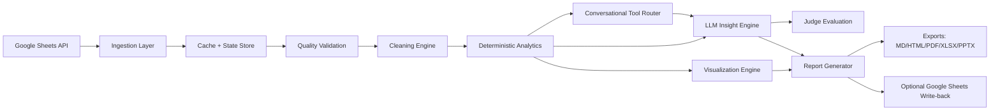
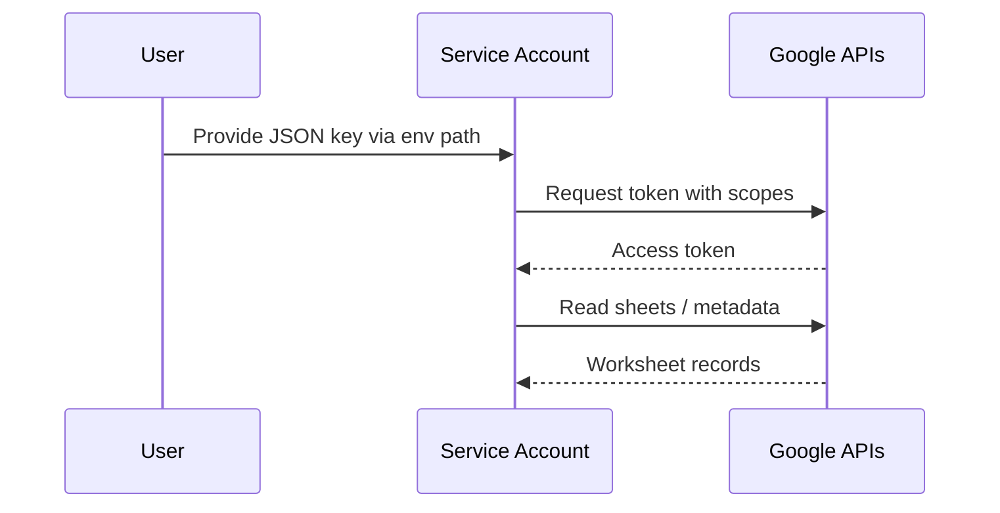
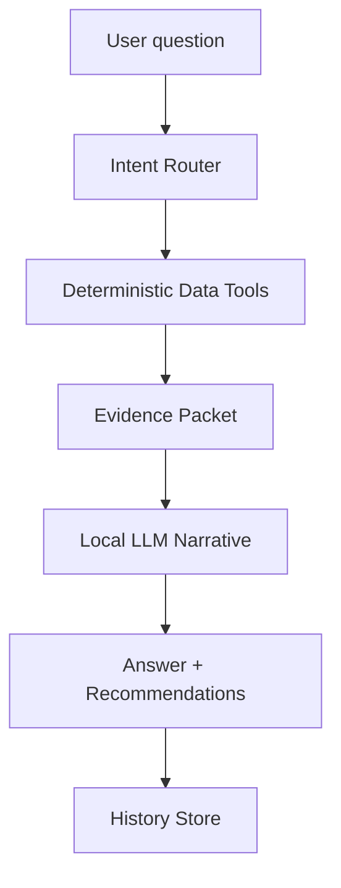

# Architecture

## 1) End-to-End Flow

## 2) Authentication Path

## 3) Conversational Analytics Pipeline

## 4) Write-back Safety
- Default behavior: create new worksheet.
- Overwrite requires explicit `overwrite=true`.
- Source worksheets never modified by default.
