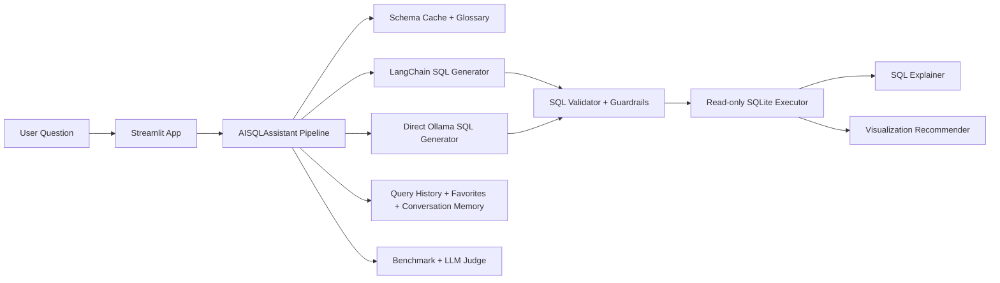

# AI SQL Analytics Assistant (LangChain + Ollama + SQLite)

Production-grade local AI SQL assistant that converts natural-language business questions into validated read-only SQL, executes queries, explains results, and visualizes outputs.

## Project Goals
- Enterprise-style NL-to-SQL assistant for analysts, PMs, and leadership.
- Strong safety layer (read-only SQL + guardrails).
- Schema-aware prompting and business glossary grounding.
- Deterministic local inference with Ollama (`temperature=0`).
- End-to-end evaluation with 100 benchmark questions and LLM-as-a-judge.

## Why This Implementation
- **SQLite**: reproducible local analytics backend, easy onboarding, zero cloud lock-in.
- **LangChain SQLDatabase**: schema-aware SQL generation baseline.
- **Ollama**: private local inference (`qwen3.5:4b`, `granite4.1:3b`).
- **Deterministic decoding**: stable SQL for safety audits, tests, and benchmark regressions.
- **Read-only DB access**: prevents destructive SQL in enterprise analytics workflows.

## Architecture


## Features
- Natural-language to SQL generation (`langchain` + `direct` modes).
- SQL validation:
  - syntax checks
  - unknown tables/columns
  - join warnings
  - unsafe keyword blocking (`INSERT/UPDATE/DELETE/DROP/ALTER/TRUNCATE/CREATE/...`)
  - suspicious comment/injection checks
- Read-only execution with timing, row counts, explain plan, complexity score.
- SQL explanation + business interpretation.
- Visualization recommendation and rendering:
  - table, bar, line, pie, scatter, histogram, heatmap, time-series
- Schema browser with table metadata, PK/FK, indexes, null stats, samples.
- Persistent query history, favorites, and conversation memory.
- Export query outputs to CSV/Excel + SQL/report download.
- Benchmark runner:
  - 100 business questions
  - full matrix: approaches (`langchain`, `direct`) x models (`qwen3.5:4b`, `granite4.1:3b`)
  - exact match, execution accuracy, result correctness, latency, complexity
  - judge scoring via `granite4.1:3b`

## Dataset
- **Primary dataset**: Northwind relational schema.
- **Data strategy**:
  - canonical raw DB: `data/sqlite/northwind_raw.db`
  - deterministic scaled DB: `data/sqlite/northwind_scaled.db`
- Build process attempts public Northwind download first, then deterministic synthetic fallback when source schema is incompatible or offline.
- Scaled DB enables realistic performance and trend analytics beyond tiny demos.

## Repository Structure
```text
src/ai_sql_assistant/
  data/               # Northwind build + scaling
  schema/             # Introspection, ERD, schema summaries
  generation/         # LangChain and direct SQL generators
  validation/         # SQL safety + semantic validator
  execution/          # Read-only SQL executor + complexity scoring
  explanation/        # SQL explanation generation
  visualization/      # Chart recommendation and rendering
  memory/             # Query history + favorites + conversation memory
  benchmarking/       # Benchmark runner + judge integration
  pipeline/           # End-to-end orchestration
streamlit_app/        # Streamlit UI
scripts/              # Data build, benchmark, reports, analysis
benchmarks/           # 100-case benchmark dataset
notebooks/            # Zero-to-hero tutorial notebook
tests/                # Unit/smoke tests
```

## Setup (uv + Python 3.12.10)
```bash
# 1) Ensure Python 3.12.10 exists locally
uv python install 3.12.10

# 2) Create local environment and install deps
uv venv --python 3.12.10 .venv
source .venv/bin/activate
uv sync --extra dev

# 3) Pull required Ollama models
ollama pull qwen3.5:4b
ollama pull granite4.1:3b

# 4) Build databases + benchmark set + diagrams
uv run python scripts/build_data.py
uv run python scripts/generate_benchmark_cases.py
uv run python scripts/run_schema_report.py
uv run python scripts/generate_diagrams.py
```

## Run
### CLI
```bash
uv run ai-sql-assistant runtime-check
uv run ai-sql-assistant data-build
uv run ai-sql-assistant schema-report
uv run ai-sql-assistant ask "Show monthly net revenue for Europe in 2024."
uv run ai-sql-assistant benchmark-run
```

### Streamlit App
```bash
uv run streamlit run streamlit_app/app.py
```

### End-to-End Orchestration
```bash
uv run python scripts/run_end_to_end.py
```

## Example Questions
- Show monthly net revenue for Europe in 2024.
- Top 10 customers by revenue in Germany.
- Compare month-over-month revenue change for USA.
- Which categories drive most Enterprise segment revenue?
- Rank customers in APAC by annual revenue.

## Evaluation Outputs
Generated artifacts appear under `artifacts/reports/`:
- `schema_report.md`
- benchmark run JSON (`benchmark_run_*.json`)
- failure analysis (`failure_analysis.json`)
- manual vs AI comparison (`manual_vs_ai_comparison.json`)
- performance analysis (`performance_analysis.md`)

### Sample Measured Metrics (2026-06-27 run)
From `benchmark_run_20260627_111555.json` (1-case matrix smoke run):

| Approach | Model | Gen Latency (ms) | Exec Latency (ms) | Rows | Tokens | Throughput (QPS) |
|---|---|---:|---:|---:|---:|---:|
| direct | granite4.1:3b | 1572.44 | 58.48 | 12.0 | 45.0 | 0.613 |
| langchain | granite4.1:3b | 8935.64 | 20.86 | 0.0 | 28.0 | 0.112 |
| direct | qwen3.5:4b | 28149.92 | 104.54 | 12.0 | 45.0 | 0.035 |
| langchain | qwen3.5:4b | 13611.79 | 55.72 | 12.0 | 45.0 | 0.073 |

### Failure Analysis Snapshot
From `failure_analysis.json`:
- Blocked by guardrails: 3 / 5 cases
- Unsafe prompt injection (`DROP TABLE`) blocked
- Hallucinated table request blocked
- Unsafe follow-up manipulation case blocked

## Testing
```bash
uv run pytest -v
```

Test coverage includes:
- SQL validation guardrails
- schema introspection
- execution behavior
- visualization recommendations
- memory persistence
- prompt templates
- Streamlit import/smoke checks

Latest local result:
- `20 passed` via `uv run pytest -q`

## Safety and Guardrails
- Rejects DDL/DML and multi-statement payloads.
- Blocks suspicious SQL comment patterns often used for injection.
- Enforces read-only SQLite connection mode.
- Performs identifier checks against introspected schema.
- Flags ambiguous joins for manual review.

## Benchmarks and Comparison
This project compares:
- **Generation strategy**: LangChain SQL generation vs direct prompting.
- **Model**: `qwen3.5:4b` vs `granite4.1:3b`.
- **Human baseline**: manual SQL vs AI-generated SQL (scripted report).

## Notebook
`notebooks/ai_sql_assistant_zero_to_hero.ipynb` is a complete tutorial covering:
- theory + SQL fundamentals
- architecture and diagrams
- prompt engineering
- end-to-end implementation walkthrough
- evaluation and failure analysis

Executed notebook artifact:
- `notebooks/ai_sql_assistant_zero_to_hero.executed.ipynb`

## Limitations
- SQLite cost estimation is heuristic (`EXPLAIN QUERY PLAN` + query complexity proxy).
- Judge quality depends on local model consistency.
- Direct model performance can vary by local hardware and quantization.

## Future Improvements
- Add semantic layer/metric store for robust KPI definitions.
- Add adaptive reranking and query repair loops.
- Add role-based access controls and row-level policy simulation.
- Extend multi-database support (Postgres, DuckDB, Snowflake read-only).

## Visual Artifacts
- ERD: `artifacts/diagrams/schema_erd.png`
- Architecture diagrams: `artifacts/diagrams/*.md`
- Performance plots: `artifacts/plots/benchmark_generation_latency.png`, `artifacts/plots/benchmark_throughput.png`

## References
- LangChain SQL docs
- Ollama API docs
- SQLite `EXPLAIN QUERY PLAN`
- Northwind relational schema
