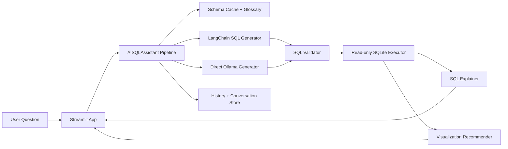

# Architecture Diagram

```mermaid
flowchart LR
    User[User Question] --> UI[Streamlit App]
    UI --> Pipeline[AISQLAssistant Pipeline]
    Pipeline --> Schema[Schema Cache + Glossary]
    Pipeline --> Gen1[LangChain SQL Generator]
    Pipeline --> Gen2[Direct Ollama Generator]
    Gen1 --> Validator[SQL Validator]
    Gen2 --> Validator
    Validator --> Executor[Read-only SQLite Executor]
    Executor --> Explain[SQL Explainer]
    Executor --> Viz[Visualization Recommender]
    Explain --> UI
    Viz --> UI
    Pipeline --> Memory[History + Conversation Store]
```
