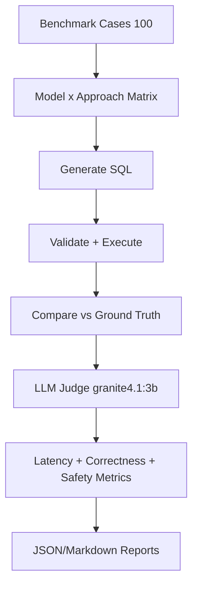

# Evaluation Workflow

```mermaid
flowchart TD
    Cases[Benchmark Cases 100] --> Matrix[Model x Approach Matrix]
    Matrix --> Run[Generate SQL]
    Run --> Validate[Validate + Execute]
    Validate --> Compare[Compare vs Ground Truth]
    Compare --> Judge[LLM Judge granite4.1:3b]
    Judge --> Metrics[Latency + Correctness + Safety Metrics]
    Metrics --> Reports[JSON/Markdown Reports]
```
