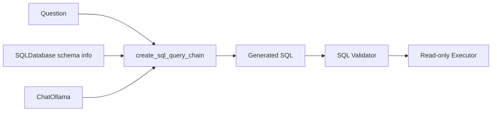

# LangChain Pipeline

```mermaid
flowchart LR
    Q[Question] --> Chain[create_sql_query_chain]
    DB[SQLDatabase schema info] --> Chain
    Model[ChatOllama] --> Chain
    Chain --> SQL[Generated SQL]
    SQL --> Validator[SQL Validator]
    Validator --> Executor[Read-only Executor]
```
