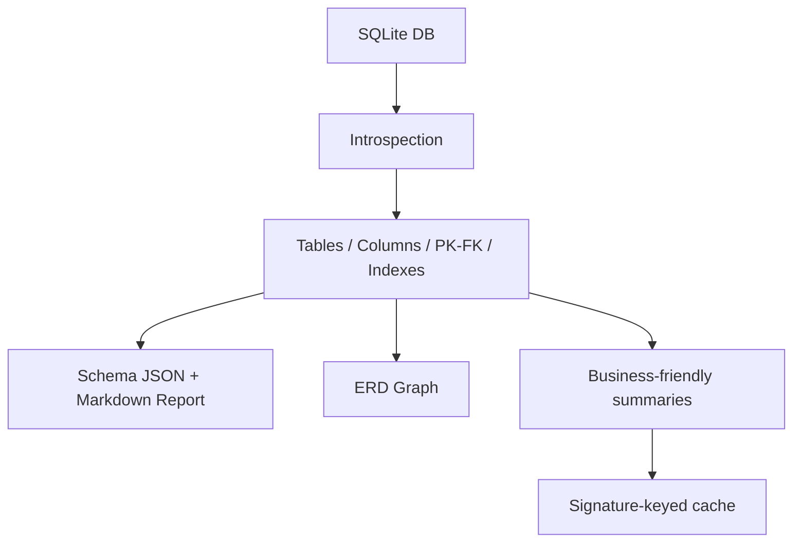

# Schema Understanding Pipeline

```mermaid
flowchart TD
    DB[SQLite DB] --> Inspect[Introspection]
    Inspect --> Meta[Tables / Columns / PK-FK / Indexes]
    Meta --> Report[Schema JSON + Markdown Report]
    Meta --> ERD[ERD Graph]
    Meta --> Summary[Business-friendly summaries]
    Summary --> Cache[Signature-keyed cache]
```
