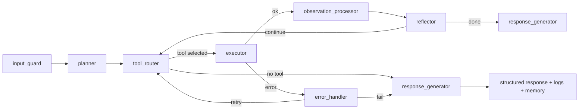

# Architecture

## LangGraph Pipeline

## Core Subsystems

- Planner: task decomposition and initial action strategy.
- Tool Router: model-guided + heuristic fallback tool selection.
- Executor: registry-driven tool invocation with schema validation.
- Memory: short-term + Chroma semantic persistence and retrieval.
- Error Handler: bounded retries and recovery-plan injection.
- Observability: structured logs, trace files, latency/counter metrics.

## Safety

- Python tool sandboxed with AST guard, process isolation, timeout, memory cap.
- File access restricted to workspace root.
- No unrestricted shell execution.
- Structured output parsing with Pydantic + automatic repair retries.
