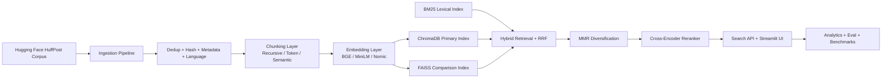

# Architecture

## Key Interfaces

- `semantic_search.service.SemanticSearchService`: orchestration entrypoint.
- `semantic_search.cli`: CLI execution surface.
- `app.py`: Streamlit UI with pages: Home, Index Builder, Documents, Search, Analytics, Benchmarks, Settings.
- `config/default.yaml`: runtime configuration.

## Storage Layout

- `data/raw/`: source dataset snapshots.
- `data/processed/documents.jsonl`: canonical documents.
- `data/processed/chunks.jsonl`: chunked corpus.
- `artifacts/chroma/`: persistent Chroma collections.
- `artifacts/faiss/`: FAISS index + metadata sidecars.
- `artifacts/reports/`: benchmark and evaluation outputs.
- `logs/search_events.jsonl`: search telemetry.
