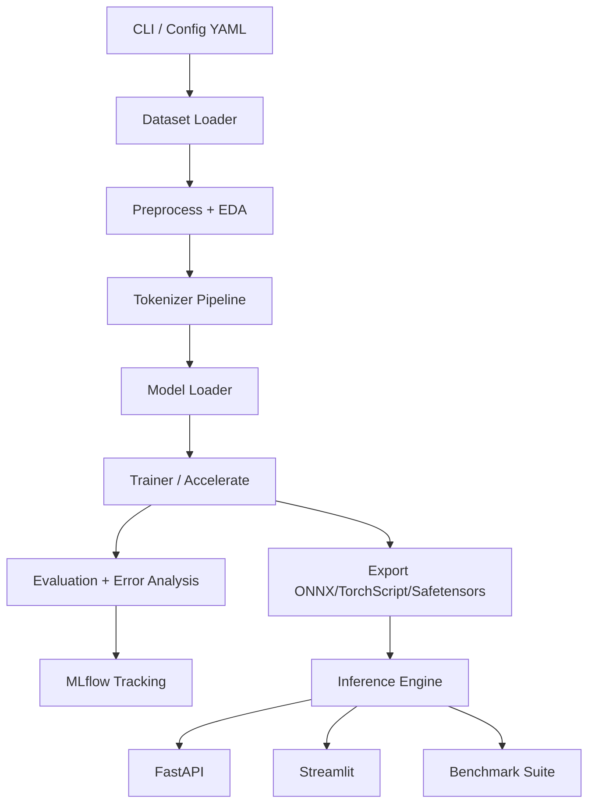

# Architecture Diagram

## Runtime Layers

1. Data Layer: load, validate, clean, dedupe, split, profile
2. Training Layer: full FT and PEFT workflows
3. Analytics Layer: metrics, explainability, error analysis, benchmarking
4. Serving Layer: API and UI with monitoring hooks
