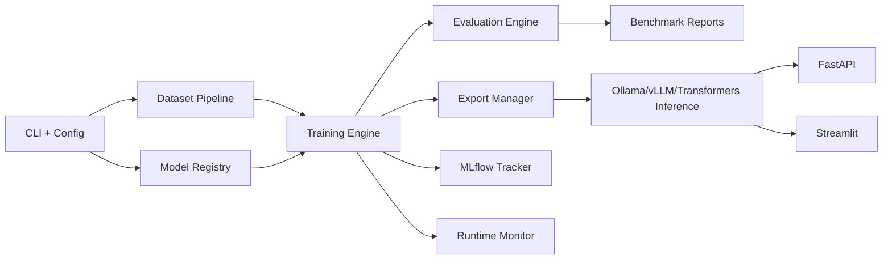
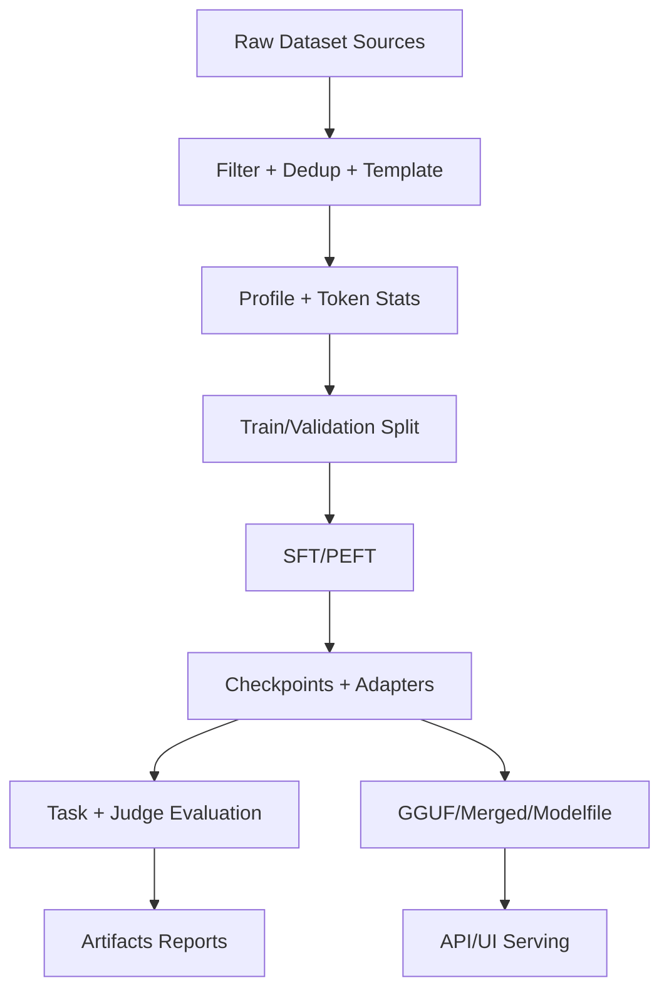

# Architecture Diagrams

## Component View

```mermaid
flowchart LR
    C[CLI + Config] --> D[Dataset Pipeline]
    C --> M[Model Registry]
    D --> T[Training Engine]
    M --> T
    T --> E[Evaluation Engine]
    T --> X[Export Manager]
    E --> B[Benchmark Reports]
    X --> O[Ollama/vLLM/Transformers Inference]
    O --> A[FastAPI]
    O --> S[Streamlit]
    T --> ML[MLflow Tracker]
    T --> MON[Runtime Monitor]
```

## Data Flow

```mermaid
flowchart TD
    R[Raw Dataset Sources] --> F[Filter + Dedup + Template]
    F --> P[Profile + Token Stats]
    P --> SPLIT[Train/Validation Split]
    SPLIT --> TRAIN[SFT/PEFT]
    TRAIN --> CKPT[Checkpoints + Adapters]
    CKPT --> EVAL[Task + Judge Evaluation]
    CKPT --> EXPORT[GGUF/Merged/Modelfile]
    EVAL --> REPORTS[Artifacts Reports]
    EXPORT --> SERVE[API/UI Serving]
```
