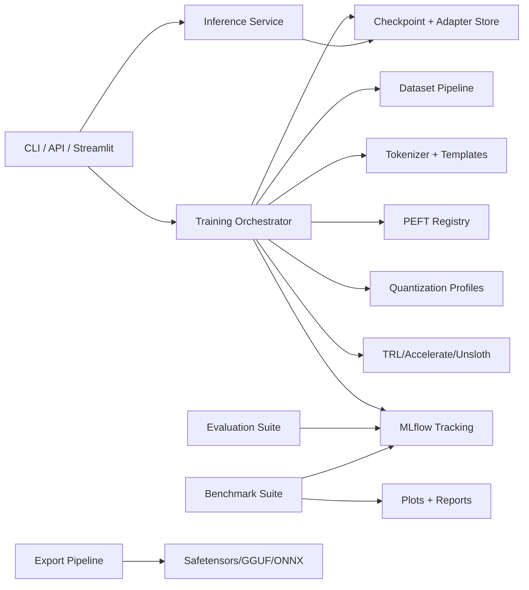

# Architecture — Production PEFT Platform

## Core Subsystems

- `data`: load, clean, dedup, split, templates, token statistics.
- `training`: smoke and full-run orchestration.
- `peft`: method registry, config builders, adapter manager.
- `evaluation`: classification + text metrics + reporting.
- `benchmarking`: latency/memory throughput and visualizations.
- `tracking`: MLflow integration.
- `api`, `ui`, `cli`: delivery surfaces using shared inference service.

## Run Manifest

Every train/eval/benchmark run stores:

- Config hash
- Runtime info (Python, CUDA, device)
- Dataset identity and split sizes
- Model and PEFT method
- Metrics and artifact paths

## Deep Matrix (v1)

- TinyLlama: all PEFT methods + full FT baseline
- Qwen3-1.7B: LoRA, QLoRA, AdaLoRA, Full FT
- SmolLM2-1.7B: LoRA, QLoRA
