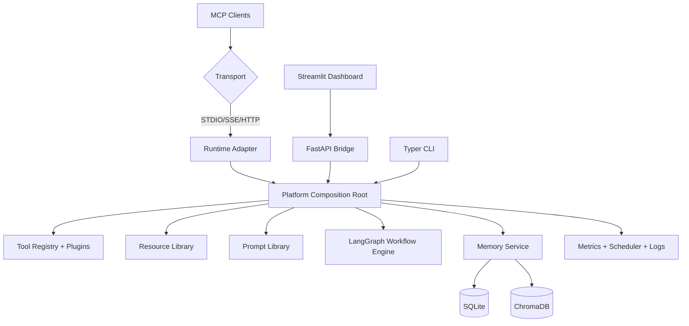

# Production-Grade MCP Server Platform

Production-ready Model Context Protocol platform with:

- Dual MCP runtimes: `FastMCP` + official `mcp` (low-level fallback enabled)
- FastAPI bridge for REST access
- Streamlit dashboard for operations
- Typer CLI for administration
- LangGraph multi-agent workflow engine
- Persistent memory with SQLite + ChromaDB
- Plugin system with allowlist + SHA256 verification
- Structured logging, monitoring metrics, scheduler jobs

This README reflects real commands and real outputs executed on **June 30, 2026** in this repository.

## 1) What Was Actually Verified

Executed and passed:

1. Dependency sync + compile + package build
2. Lint + full test suite
3. Live API server run with authenticated endpoint calls
4. Streamlit app entrypoint run + real HTTP page response capture
5. STDIO server entrypoints (both runtimes) run without startup crash
6. Artifact integrity checks with content assertions

Generated verification artifacts:

- [`reports/e2e_api_live_health.json`](reports/e2e_api_live_health.json)
- [`reports/e2e_api_live_tools.json`](reports/e2e_api_live_tools.json)
- [`reports/e2e_api_live_resources.json`](reports/e2e_api_live_resources.json)
- [`reports/e2e_api_live_prompts.json`](reports/e2e_api_live_prompts.json)
- [`reports/e2e_api_live_calculator.json`](reports/e2e_api_live_calculator.json)
- [`reports/e2e_api_live_workflow.json`](reports/e2e_api_live_workflow.json)
- [`reports/e2e_api_live_metrics.json`](reports/e2e_api_live_metrics.json)
- [`reports/e2e_streamlit_home.html`](reports/e2e_streamlit_home.html)
- [`reports/e2e_verification_summary.json`](reports/e2e_verification_summary.json)
- [`FINAL_PROJECT_VERIFICATION_REPORT.md`](FINAL_PROJECT_VERIFICATION_REPORT.md)

Build outputs:

- `dist/production_mcp_server_platform-0.1.0.tar.gz`
- `dist/production_mcp_server_platform-0.1.0-py3-none-any.whl`

## 2) Architecture (Practical View)

### Core execution path

1. `Platform.from_config()` bootstraps typed settings, auth, memory, tools, resources, prompts, workflows, monitoring, scheduler.
2. Runtime adapters expose the same capability registry to MCP transports.
3. FastAPI bridge calls the same tool/prompt/resource/memory services used by MCP runtime.
4. Workflow engine orchestrates Planner -> Tool Selector -> Router -> Execution -> Reflection -> Memory -> Report.
5. Everything is persisted in SQLite, semantic memory in ChromaDB (configurable).

### Architecture diagram



### Key modules

- `src/server/platform.py`: composition root
- `src/tools/builtin.py`: 19 production tools + safety
- `src/tools/plugins.py`: plugin loading + SHA256 allowlist checks
- `src/memory/sqlite_store.py`: operational persistence + cache + metrics
- `src/memory/chroma_store.py`: vector memory integration
- `src/workflows/graph.py`: multi-agent orchestration
- `src/api/app.py`: REST bridge endpoints
- `src/cli/main.py`: admin/ops command surface
- `src/ui/streamlit_app/`: dashboard pages

## 3) Exact Setup (Zero to Hero)

```bash
cd production_mcp_server
uv venv .venv
source .venv/bin/activate
UV_CACHE_DIR=.uv-cache uv sync --all-groups
```

Optional compile + package build:

```bash
UV_CACHE_DIR=.uv-cache uv run python -m compileall src
UV_CACHE_DIR=.uv-cache uv build
```

## 4) Run the Platform

### A. CLI diagnostics

```bash
UV_CACHE_DIR=.uv-cache uv run mcp-server doctor --config configs/default.yaml
UV_CACHE_DIR=.uv-cache uv run mcp-server tools --config configs/default.yaml
UV_CACHE_DIR=.uv-cache uv run mcp-server resources --config configs/default.yaml
UV_CACHE_DIR=.uv-cache uv run mcp-server prompts --config configs/default.yaml
```

### B. Live API server (real E2E)

```bash
# runs on port 8011 via env override in verification flow
MCP_SERVER__TRANSPORT__PORT=8011 UV_CACHE_DIR=.uv-cache uv run mcp-server run --mode api --config configs/default.yaml
```

Authenticated API examples (real payloads used):

```bash
curl -H 'x-api-key: local-user' http://127.0.0.1:8011/tools
curl -H 'x-api-key: local-user' -H 'content-type: application/json' \
  -d '{"tool_name":"calculator","arguments":{"expression":"(7+5)*3"},"session_id":"e2e-api-live"}' \
  http://127.0.0.1:8011/tools
curl -H 'x-api-key: local-user' -H 'content-type: application/json' \
  -d '{"query":"Generate production report after memory lookup"}' \
  http://127.0.0.1:8011/reports
curl -H 'x-api-key: local-admin' http://127.0.0.1:8011/metrics
```

### C. Streamlit dashboard

Primary entrypoint:

```bash
UV_CACHE_DIR=.uv-cache uv run python app.py
```

Also verified directly:

```bash
UV_CACHE_DIR=.uv-cache uv run streamlit run src/ui/streamlit_app/Home.py --server.headless true --server.address 127.0.0.1 --server.port 8503
```

### D. MCP runtime entrypoints (stdio)

```bash
# FastMCP runtime (default)
UV_CACHE_DIR=.uv-cache uv run python server.py

# Official MCP runtime fallback
MCP_SERVER__TRANSPORT__RUNTIME=mcp UV_CACHE_DIR=.uv-cache uv run python server.py
```

## 5) Testing and Quality Gate

```bash
UV_CACHE_DIR=.uv-cache uv run ruff check src
UV_CACHE_DIR=.uv-cache uv run pytest -q
```

Observed result in this run:

- Ruff: `All checks passed!`
- Pytest: `7 passed`

Verified output summary from `reports/e2e_verification_summary.json`:

| Check | Result |
| --- | --- |
| tools discovered | 19 |
| resources discovered | 5 |
| prompts discovered | 8 |
| workflow status | completed |
| metrics rows persisted | 12 |
| build artifacts | sdist + wheel |

## 6) Configuration Guide

Main file: [`configs/default.yaml`](configs/default.yaml)

High-impact keys:

- `transport.runtime`: `fastmcp | mcp`
- `transport.mode`: `stdio | sse | http | streamable-http`
- `auth.api_keys`: API key -> role mapping (`admin`, `user`, `read_only`)
- `auth.read_only_mode`: blocks mutating actions globally
- `memory.chroma_enabled`: toggle vector memory
- `plugins.allowlist_manifest`: plugin trust policy
- `scheduler.*`: indexing/cleanup/report intervals

Environment override format:

```bash
MCP_SERVER__SECTION__FIELD=value
```

Example:

```bash
MCP_SERVER__TRANSPORT__PORT=8011
MCP_SERVER__TRANSPORT__RUNTIME=mcp
```

## 7) Security Controls Implemented

- API key authentication + RBAC
- Read-only mode enforcement for mutating tools
- Python execution sandbox (AST restrictions, memory/timeout limits)
- Shell command allowlist enforcement
- Plugin integrity verification using SHA256 allowlist
- Audit logs for API actions

## 8) Tooling Surface

Implemented 19 tools:

1. calculator
2. weather
3. file_reader
4. file_writer
5. csv_reader
6. json_reader
7. sqlite_query
8. chroma_search
9. web_search
10. github_search
11. news_search
12. python_executor
13. markdown_generator
14. report_generator
15. pdf_generator
16. directory_search
17. code_search
18. shell_command
19. system_information

## 9) Known Practical Constraints

- Official `mcp` package in this environment does not expose high-level `MCPServer`; platform auto-falls back to low-level official server API.
- Socket-level verification needed escalated permissions in this environment.

## 10) Project Tree

```text
production_mcp_server/
├── notebook/
├── src/
│   ├── api/
│   ├── auth/
│   ├── cli/
│   ├── config/
│   ├── memory/
│   ├── monitoring/
│   ├── prompts/
│   ├── resources/
│   ├── server/
│   ├── tools/
│   ├── ui/
│   ├── utils/
│   ├── workflows/
│   └── tests/
├── chroma_db/
├── database/
├── logs/
├── reports/
├── configs/
├── screenshots/
├── app.py
├── server.py
└── README.md
```

## 11) Client Integration Templates

These setup snippets are provided for compatibility and were prepared against the implemented server entrypoints. They are not marked as executed unless explicitly noted.

### Claude Desktop (template)

`claude_desktop_config.json`:

```json
{
  "mcpServers": {
    "production-mcp-server": {
      "command": "/home/ahmad/AI/Github/40 AI-ML Projects for Beginners/MCP/Production-Grade MCP Server Platform/production_mcp_server/.venv/bin/python",
      "args": [
        "/home/ahmad/AI/Github/40 AI-ML Projects for Beginners/MCP/Production-Grade MCP Server Platform/production_mcp_server/server.py"
      ],
      "env": {
        "MCP_SERVER__CONFIG_PATH": "/home/ahmad/AI/Github/40 AI-ML Projects for Beginners/MCP/Production-Grade MCP Server Platform/production_mcp_server/configs/default.yaml",
        "UV_CACHE_DIR": "/home/ahmad/AI/Github/40 AI-ML Projects for Beginners/MCP/Production-Grade MCP Server Platform/production_mcp_server/.uv-cache"
      }
    }
  }
}
```

### Codex CLI / Claude Code / Cursor / Continue / OpenCode (stdio template)

```bash
cd production_mcp_server
UV_CACHE_DIR=.uv-cache uv run python server.py
```

### LangGraph or custom Python MCP client (REST bridge shortcut)

```bash
cd production_mcp_server
MCP_SERVER__TRANSPORT__PORT=8011 UV_CACHE_DIR=.uv-cache uv run mcp-server run --mode api --config configs/default.yaml
```

Health validation:

```bash
curl -H "x-api-key: local-user" http://127.0.0.1:8011/health
```

## 12) Screenshots

Place actual captured screenshots in `screenshots/`:

- MCP Inspector tool/prompt/resource discovery
- Streamlit dashboard pages
- FastAPI Swagger UI
- CLI output samples
- workflow execution and monitoring pages

Current artifact evidence from this run:

- `reports/e2e_streamlit_home.html`
- `reports/e2e_api_live_*.json`

## 13) References

- MCP Python SDK: https://github.com/modelcontextprotocol/python-sdk
- FastMCP: https://github.com/jlowin/fastmcp
- LangGraph docs: https://langchain-ai.github.io/langgraph/
- FastAPI docs: https://fastapi.tiangolo.com/
- Streamlit docs: https://docs.streamlit.io/
- ChromaDB docs: https://docs.trychroma.com/
- Ollama docs: https://ollama.com/library

## 14) Next Operational Steps

1. Capture requested UI screenshots into `screenshots/` (see `screenshots/README.md`).
2. Add CI pipeline for `ruff + pytest + build` gates.
3. Add high-level official MCP adapter path once target environment upgrades `mcp` package API.
