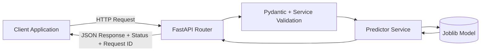
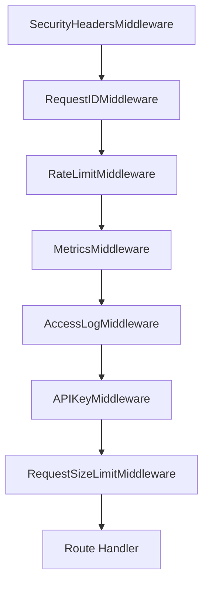
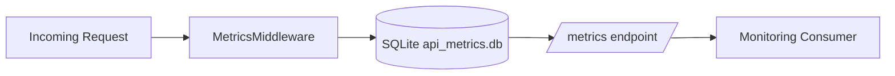

# API Architecture Diagrams

## 1. Request-Response Lifecycle



## 2. Inference + Explainability Path

```mermaid
flowchart TD
    A[/predict or /predict-batch/] --> B[Schema Validation]
    B --> C[Predictor.load() check]
    C --> D[Model.predict]
    D --> E[Response Schema]

    X[/explain/] --> Y[Schema Validation]
    Y --> Z[Predictor.explain_one]
    Z --> K[SHAP Explainer
Tree -> Linear -> Kernel fallback]
    K --> L[Feature Contributions JSON]
```

## 3. Middleware Stack (Outer -> Inner)



## 4. Metrics and Observability


