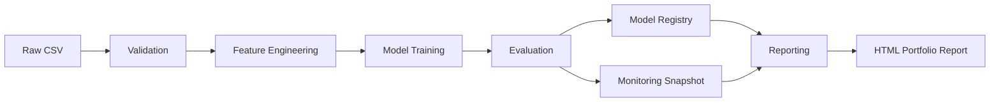

# MLOps Pipeline using Apache Airflow

Portfolio-grade local MLOps system for **1-day ahead app usage forecasting** from mobile behavior data.

This project is built as a zero-to-hero learning path and as an engineering artifact:
- MLOps lifecycle fundamentals
- Apache Airflow orchestration and scheduling
- Data quality validation and drift checks
- Feature engineering and feature selection
- Multi-model benchmarking + AutoML stack
- Model evaluation, registry, monitoring, and reporting
- Reproducible local execution with `uv` + Python 3.12.10

## Executive Summary

Input data (`Date`, `App`, `Usage (minutes)`, `Notifications`, `Times Opened`) is validated, transformed into leakage-aware forecast features, benchmarked across linear/tree/boosting models, then tracked in a local registry and monitoring layer.  

The repository includes five DAGs:
1. `01_data_validation`
2. `02_feature_engineering`
3. `03_model_training`
4. `04_reporting`
5. `05_end_to_end` (single-DAG orchestrator of full lifecycle)

## 1) MLOps Fundamentals

### Definition
MLOps is the operational discipline that turns ML experiments into reliable, repeatable, monitorable production systems.

### Why it matters
Notebook-only workflows fail under scale and change:
- hidden state and non-reproducible results
- no lineage or rollback
- no runtime observability
- manual retraining and manual quality checks

### ML lifecycle in this repo
- Data pipeline: raw load, augmentation, schema/domain checks, drift checks
- Feature pipeline: temporal, lag, rolling, behavior, interactions, persistence
- Model pipeline: benchmark + AutoML candidates + champion selection
- Registry pipeline: versioned model artifact + metadata + stage mapping
- Monitoring pipeline: error thresholds, drift thresholds, runtime telemetry
- Reporting pipeline: metrics/figures/monitoring to HTML portfolio report

## 2) Apache Airflow Fundamentals

### Concepts used
- DAG
- TaskFlow API (`@dag`, `@task`)
- `PythonOperator`
- `BashOperator`
- `FileSensor`
- retries + retry delay
- cron scheduling + catchup
- XCom for small metadata only

### Why Airflow here
Airflow provides deterministic orchestration, dependency management, scheduling, and run-level observability with logs and task graph UI.

### Tool tradeoffs
| Tool | Strength | Weakness |
|---|---|---|
| Cron | simple, tiny footprint | no dependency graph, poor observability |
| Airflow | mature DAG scheduler + UI + retries | heavier setup |
| Prefect | clean Python flow authoring | smaller ecosystem for legacy ETL ops |
| Dagster | strong asset lineage model | migration cost / different model |
| Kubeflow | cloud-native ML platform | high infra complexity |

## 3) System Architecture



### Separation of concerns
- `modules/data_*`: ingestion, persistence, validation
- `modules/feature_*`: feature creation and ranking
- `modules/model_*`: training, evaluation, registry
- `modules/monitoring.py`: drift/runtime/alert generation
- `modules/reporting.py`: HTML report rendering
- `dags/*.py`: orchestration only

## 4) Dataset, EDA, and Forecast Target

### Target
`target_next_day` = next-day usage minutes per app (`forecast_horizon_days=1`)

### EDA coverage (notebooks)
- usage distribution
- notification/open behavior
- per-app usage patterns
- daily and weekly trend analysis
- seasonality diagnostics

## 5) Feature Engineering and Leakage Controls

### Feature families
- Temporal: day/week/month/quarter, weekend/month boundaries, holiday flag
- Lag: prior usage/notifications/opens
- Rolling: trailing means and stds
- Behavior: notifications-per-minute, open frequency, engagement score
- Interaction: notifications×opens, usage×opens

### Leakage-safe design decisions
- target created with forward shift (`groupby(app).shift(-horizon)`)
- temporal split for train/test (chronological)
- feature selection computed on train partition only
- imputer fit only on train and applied to test
- no dataset-wide median fill before splitting

## 6) Benchmarking Stack and Tradeoffs

### Explicit benchmark models
- LinearRegression, Ridge, Lasso, ElasticNet
- RandomForest, ExtraTrees, GradientBoosting
- XGBoost, LightGBM, CatBoost (when available)

### AutoML tools (all included in code path)
- **LazyPredict**  
Strength: quick broad baseline scan  
Weakness: can be slow on large feature spaces; bounded here with sampling

- **FLAML**  
Strength: efficient time-budgeted optimization  
Weakness: optional dependency fragility in constrained environments

- **PyCaret**  
Strength: high-level compare+tune workflow, strong pedagogy  
Weakness: current upstream runtime incompatibility on Python 3.12 in many builds

### Practical compatibility note
This project targets Python 3.12.10. In this environment:
- LazyPredict works
- FLAML AutoML may be unavailable depending on local package resolution
- PyCaret is auto-detected and gracefully skipped when unsupported

Dependency availability is saved in model metrics metadata (`dependency_status`) for audit transparency.

## 7) Evaluation, Registry, and Monitoring

### Metrics
- MAE
- MSE
- RMSE
- R²
- MAPE

### Diagnostics
- residuals vs predicted
- prediction vs actual
- error distribution

### Registry
- path: `outputs/models/screentime_predictor/vN/`
- files: `model.joblib`, `metadata.json`
- stage map: `stages.json`
- metadata includes timestamp, metrics, hyperparameters, feature list, MLflow run id

### Monitoring
- drift: PSI + KS checks
- performance threshold alerts
- runtime telemetry + slowest task
- snapshots: `outputs/monitoring/monitoring_snapshot_*.json`

## 8) Scheduling Design

Configured in `config.yaml`:
- validation: `0 6 * * *`
- feature engineering: `15 6 * * *`
- training: `0 7 * * 1`
- reporting: `30 7 * * 1`
- catchup: `false`

## 9) Local Setup and Execution

### Prerequisites
- Python 3.12.10
- `uv`

### Bootstrap
```bash
./scripts/bootstrap_local.sh
```

### Run full local pipeline (module runner)
```bash
./scripts/run_local_pipeline.sh
```

### Airflow local runtime
```bash
export AIRFLOW_HOME=$(pwd)/airflow_config
export AIRFLOW__CORE__DAGS_FOLDER=$(pwd)/dags
export AIRFLOW__CORE__LOAD_EXAMPLES=False

.venv/bin/airflow db migrate
.venv/bin/airflow scheduler
.venv/bin/airflow webserver --port 8080
```

### DAG validation commands
```bash
.venv/bin/airflow dags list
.venv/bin/airflow dags test 01_data_validation 2026-06-24
.venv/bin/airflow dags test 02_feature_engineering 2026-06-24
.venv/bin/airflow dags test 03_model_training 2026-06-24
.venv/bin/airflow dags test 04_reporting 2026-06-24
.venv/bin/airflow dags test 05_end_to_end 2026-06-24
```

## 10) Notebooks (Tutorial Mini-Book)

1. `notebooks/01_mlops_fundamentals.ipynb`
2. `notebooks/02_airflow_dags.ipynb`
3. `notebooks/03_eda.ipynb`
4. `notebooks/04_feature_engineering.ipynb`
5. `notebooks/05_model_training.ipynb`
6. `notebooks/06_monitoring_reporting.ipynb`

Notebook execution command:
```bash
.venv/bin/python -m jupyter nbconvert --to notebook --execute notebooks/01_mlops_fundamentals.ipynb --output /tmp/01_exec.ipynb
```

If `nbconvert` is unavailable, run `uv sync` once network access is available.

## 11) Quality and Verification

### Automated validation present
- DAG parse and DAG execution checks
- module-level smoke tests
- compile-time checks (`python -m compileall`)

### Current environment limitations observed
- network/DNS restrictions blocked fresh dependency resolution from PyPI during `uv sync`
- `pytest` and `nbconvert` may be missing until online sync succeeds

The project now degrades gracefully and reports optional-tool availability instead of failing silently.

## 12) Lessons Learned and Production Recommendations

### Lessons
- leakage prevention belongs in code, not just notebook commentary
- orchestration reliability depends on idempotent, narrow-scoped tasks
- observability artifacts must be generated from real runs, not placeholders

### Production next steps
- move Airflow metadata DB to Postgres
- use Local/Celery/Kubernetes executor (not SQLite/Sequential for scale)
- push artifacts to object storage
- add CI gates: DAG parse test, smoke tests, notebook execution, data contract checks
- integrate external alert routes (Slack/Email/PagerDuty)
- define champion/challenger rollback policy from monitoring SLA breaches
