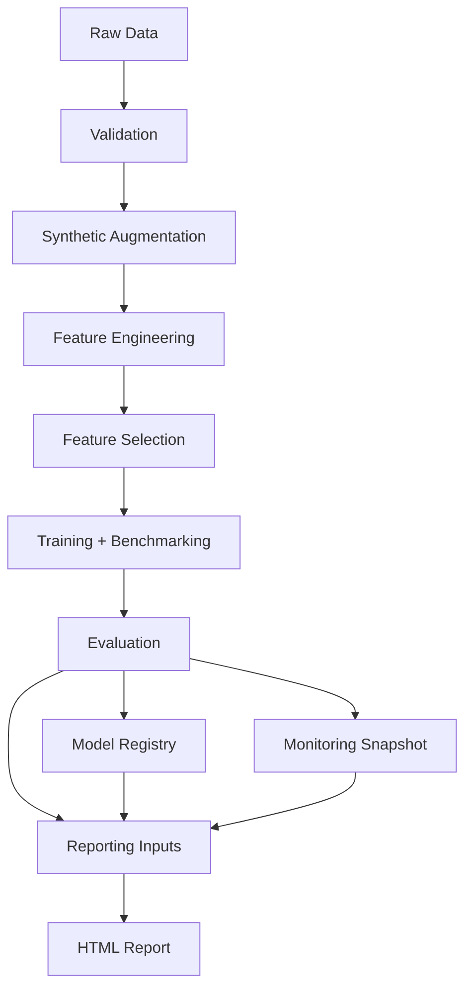
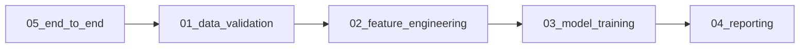

# Design: Local Production-Style MLOps Pipeline with Airflow

## Objective
Build a local but production-style MLOps platform for next-day app usage forecasting.

## System goals
- reproducible end-to-end runs
- modular stages with explicit artifacts
- time-series-safe modeling
- clear model lineage
- monitoring and alertability

## High-level architecture

## DAG architecture

## Data contracts
- raw: CSV with schema (`Date`, `App`, `Usage (minutes)`, `Notifications`, `Times Opened`)
- validated: parquet for downstream stability
- features: parquet with engineered features + `target_next_day`
- train/test: temporal split parquets

## Model lifecycle
- benchmark explicit models
- run LazyPredict/FLAML/PyCaret
- select champion by RMSE
- store model + metadata version in filesystem registry
- log run metadata to local MLflow

## Monitoring lifecycle
- feature drift: PSI + KS
- quality threshold alerts
- runtime threshold alerts
- snapshot persisted as JSON

## Key decisions
1. SequentialExecutor + SQLite for local simplicity.
2. Filesystem registry for zero-infra local lineage.
3. Time-based split to avoid leakage.
4. Config-driven behavior from `config.yaml`.

## Risks and mitigations
- dependency/version instability for heavy AutoML stack:
  - mitigation: defensive fallbacks + deterministic core benchmark path
- local runtime variance:
  - mitigation: runtime reports and configurable budgets
- synthetic data realism:
  - mitigation: app-profile-driven generation with controlled noise
