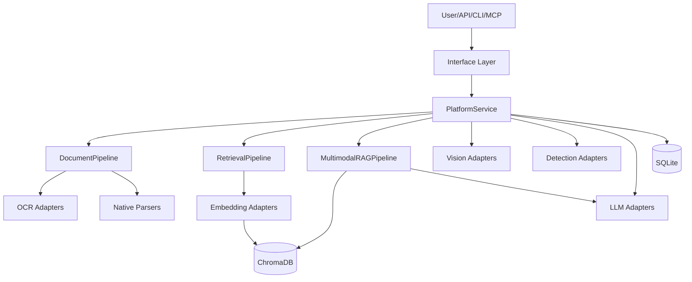

# Architecture Details

## System Diagram (Mermaid)

## Plugin Contract

Adapters registered through `AdapterRegistry`:

- `register_vision(name, factory)`
- `register_embedding(name, factory)`
- `register_ocr(name, factory)`
- `register_detector(name, factory)`
- `register_llm(name, factory)`

Core service only depends on interface contracts, not concrete model classes.

## Data Stores

### SQLite tables

- `assets`
- `captions`
- `ocr_results`
- `detections`
- `processing_history`
- `model_usage_metrics`

### Chroma collections

- `image_embeddings`
- `ocr_embeddings`
- `document_embeddings`
- `screenshot_embeddings`
- `chart_embeddings`

## Reliability and Degrade Strategy

- Local-only default runtime.
- Missing model does not crash whole service.
- Fallback adapters provide deterministic outputs with explicit low confidence.
- `doctor` command surfaces readiness and missing dependencies.
